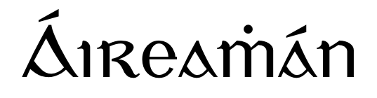

<p align="center">
  
</p>

Is teanga ríomhchlárúcháin beag é Áireamhán, atá ar fáil trí meán na Gaeilge.  Tá an teanga scríofa i Python agus bunaithe ar [Lisp](https://en.wikipedia.org/wiki/Lisp_(programming_language)) ([Scheme](http://norvig.com/lispy.html) ach go háirithe), baineann sé úsáid as comhréir an teanga seo ach le gach gnás sainithe as Gaeilge. Is féidir an teanga a úsáid ó REPL, nó tríd feidhm a léamh ó comhad. Tá cúpla samplaí den teanga ar fáil sa filltéan ```samplaí```.


```
áireamhán > (scríobh "Dia Dhuit Domhan!")
Dia Dhuit Domhan!
```

---

Áireamhán is a small, Irish programming language. It is implemented in Python and based on Lisp (specifically [Scheme](http://norvig.com/lispy.html)), using much of the same syntax and conventions but with all procedures defined in Irish. The language can be used from a REPL or alternatively procedures can be read from files. Sample procedures can be found in the ```samplaí``` directory, along with some documentation.
